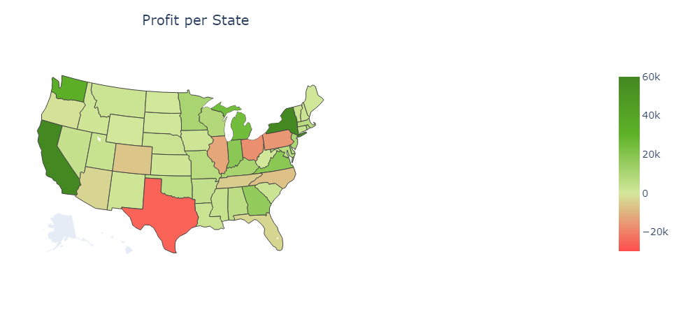
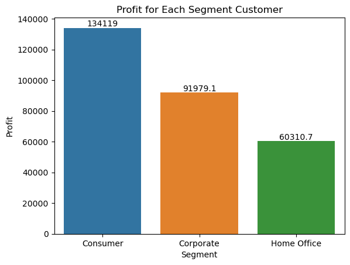
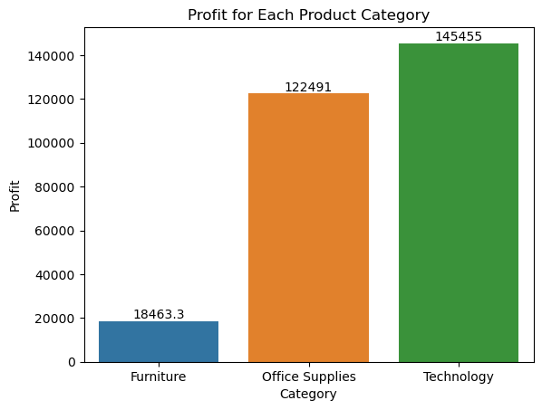
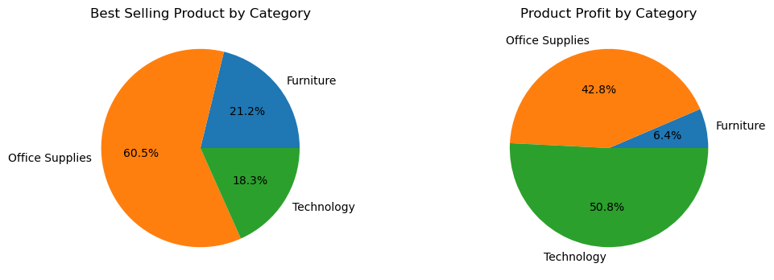
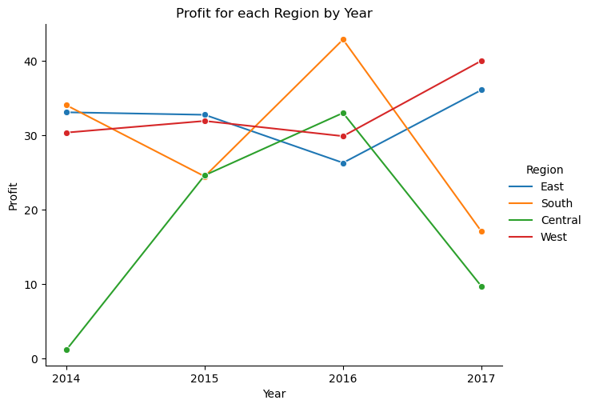

# Superstore Sales Analysis and Visualization

This repository contains a data analysis and visualization project focused on exploring sales data from Superstore dataset. The project includes data cleaning and preprocessing, exploratory data analysis and the creation of interactive visualizations and a dashboard to help identify sales trends and insights.

## Project Overview
The Superstore Sales Analysis and Visualization project aims to analyze sales data from Superstore and provide insights and recommendations for improving profit. Through data cleaning, exploratory data analysis, and the creation of interactive visualizations and a dashboard using Python and Tableau, we identify key factors driving sales and discover insights that can be applied to real-world business scenarios.

## Tools and Technologies
- Python
- Jupyter Notebook
- Pandas
- NumPy
- Matplotlib
- Seaborn
- Tableau

## File Description
- `SuperStore_Sales_Analysis.ipynb` : Jupyter Notebook containing the code used for data cleaning, exploratory data analysis, and visualization.
- `SuperStore_Sales_Data.csv` : CSV file containing the Superstore sales data.
- `images/` : Folder containing data visualization.

## Exploratory Data Analysis
To achieve the Superstore goals, we need to perform data analysis and create a data visualization so we can understand the data better. This analysis then used to draw conclusion and to give some suggestion for the company.

### Profit by State
---

### Profit by Segment
---

### Profit by Category
---

### Profit by Sub-Category
---

### Best Selling Category
---

### Profit pre Region by Year
---

## Comclusion
The analysis and visualization of the Superstore sales data revealed several key insights, as follows :
- Most profitable and unprofitable state
- Most proftable customer segment
- Most profitable product category
- Best selling product
- Company profit in each region in the last 4 years

These insights can be used to identify opportunities for improving company profit within the Superstore business.

## Suggestion
- Increasing company profits can be done by increasing sales in states with high profits, or by increasing sales profits in states where profits are low.
- Increasing sales profits can be done by targeting which customers and products will increase sales. By increasing sales to the right customers and products, which is consumer segment and the technology category, the company can maximize their profit.
- Furthermore, reducing sales in product categories or sub-categories that are experiencing losses (in this case the furniture sub-category) can also increase overall company profits. If the product is indeed making a loss then it is worth considering whether it needs to be resold in the following year or not.

Apart from that, the number of customers has no relationship with the profits the company makes, so the company is not obliged to spend money to add customers. The factor that has most influenced the company's profits in the last 4 years is the `discount` given to customers. Discounts that are `too large` cause the company to experience `losses` in several states, so the amount of this discount needs to be re-evaluated so that it does not harm the company.

## Acknowledgements
The Superstore sales data used in this project was obtained from [Kaggle](https://www.kaggle.com/datasets/vivek468/superstore-dataset-final)

Dashboard visualization for this project on [Tableau](https://public.tableau.com/app/profile/gilang.wiradhyaksa/viz/Milestone_1_16952848245730/Milestone_1)
